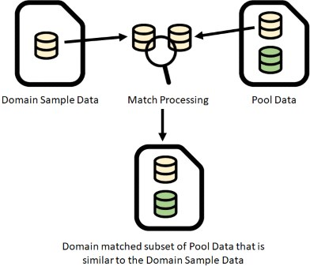
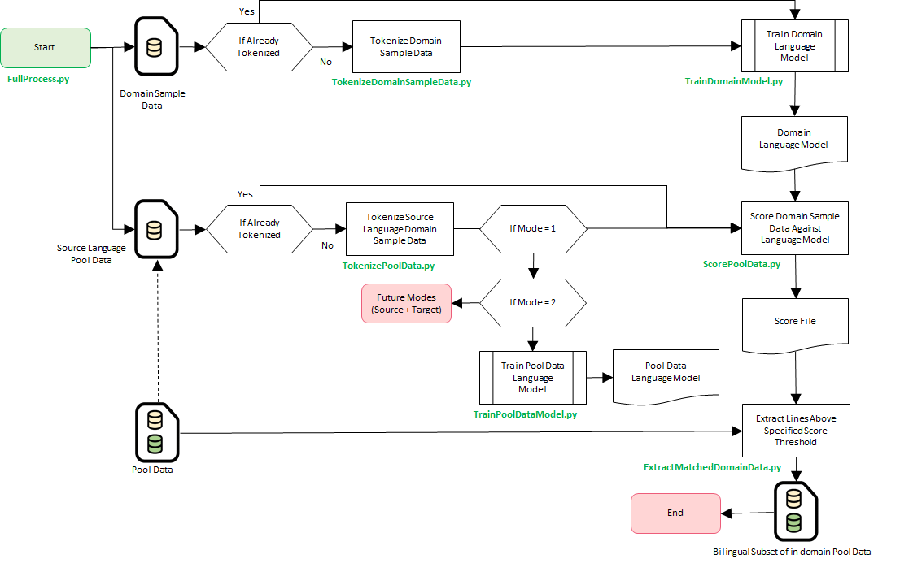

# Domain Adaptation
## Table of Contents
- [Introduction](#introduction)
  - [What is Domain Adaptation](#what-is-domain-adaptation)
  - [Approach](#approach)
  - [How Scoring Works](#how-scoring-works)
  - [Very Large Data Recommendations](#very-large-data-recommendations)
- [Installation](#installation)
 [Processes and Tools](#processes-and-tools)
  - [Preparing Data](#full-process)
  - [Full Process](#full-process)
  - [Output Files](#output-files)
    - [Extracted Domain Matched Data](#extracted-domain-matched-data)
    - [Domain Model](#domainmodel)
    - [Scores](#scores)
  - [Individual Tools](#individual-tools)
    - [TokenizeDomainSampleData.py](#tokenizedomainsampledatapy)
    - [TokenizePoolData.py](#tokenizepooldatapy)
    - [TrainDomainModel.py](#traindomainmodelpy)
    - [TrainPoolDataModel.py](#trainpooldatamodelpy)
    - [ScorePoolData.py](#scorepooldatapy)
    - [ExtractMatchedDomainData.py](#extractmatcheddomaindatapy)
- [Comparative BLEU Score Analysis](#comparative-bleu-score-analysis)
- [FAQ](#FAQ)


----
## Introduction
### What is Domain Adaptation?
Domain Adaptation in lay terms is the biasing of the training data used to train machine translation (MT) to match the domain of the content being translated to yield higher quality domain-specific translation.

Although high-quality domain-specific translation is important in the real-world use, the domain-specific corpora required to train MT to produce such translations are difficult to acquire and identify. In many cases, domain-specific corpora are non-existent or very scarce. This has resulted in most MT systems being trained on generic, unknown domains and out-of-domain that performs poorly. It has been clearly demonstrated that much more impressive results can be achieved when there MT systems are trained using high-quality in-domain parallel corpora than with larger volumes of unknown domain parallel corpora. 

Domain adaptation for Statistical Machine Translation (SMT) and Neural Machine Translation (NMT) is a very important research topic that aims to enable higher quality translations that are more closely matched and optimized for a specific context or domain. Irrespective of the technology used to translate, all approaches leverage in-domain data that is matched to a desired domain to deliver higher quality translations. 

These tools in this sub-project of ParaCrawl are designed to extract domain-specific parallel corpora from a large body of unknown domain corpora using a monolingual corpus as a filtering and scoring mechanism. These tools do not analyze the quality of the translations in the parallel corpora, that is a different task, which is addressed by a number of sister technologies within the ParaCrawl project. This approach operates only on one side of a parallel corpus to determine whether it is in a similar domain to a provided monolingual corpus.

### Approach
Domain Adaptation in the context of machine translation is achieved by training machine translation engines using a set of domain specific parallel corpora. The challenge in doing so is to identify domain specific parallel corpora that are suitable for training an MT engine.

Parallel corpora, such as ParaCrawl, have very large volumes of data in many different domains mixed together. Often the data has been collected from unknown sources without any associated metadata that could identify the content as belonging to any particular domain. For example, websites crawled could include content about information technology, life sciences, travel, shopping, automotive and much more. 

This set of tools is designed to extract domain-specific parallel corpora from a pool of existing parallel corpora (i.e., ParaCrawl) using in-domain monolingual corpora. A model is trained on in-domain monolingual corpora that are used to score the larger pool of parallel corpora. Once scores have been produced, different extracts can be created using a user specified score threshold.



**Definitions:**
* Domain Sample Data:
  * The source and/or target language data that represents the content that is in domain. 
  * Larger amount of data will provide better results.
  * This data will be used to train a model for use in domain analysis.
  * This data can be existing bilingual data or could be monolingual data in the source and/or language data that is in domain. 
* Pool Data: 
  * Bilingual data that is from mixed domains. 
  * ParaCrawl an example the kind of data that would be suitable to uses as Pool Data.
* Domain Matched Data: 
  * The subset of Pool Data that is determined to be similar to the Domain Sample Data.
  * This data is bilingual and suitable for training a domain specific engine.
* Language Codes:
  * These are based on [ISO 639-1](http://www.loc.gov/standards/iso639-2/php/code_list.php), which represents most major languages in the world and is used frequently by many tools such as Moses to indicate the language for tokenization and other processing. 
  * The Pool Data should be stored based on Language Code. If you need to use alternate language codes, then the Pool Data file structure and Tokenizer must have matching language codes.

## How Scoring works
Data is scored using [Moore and Lewis's approach](http://research.microsoft.com/apps/pubs/default.aspx?id=138756) and offers a higher precision of translation models for machine translation.  

The method scores the *Pool Data* against the *Domain* data and write a score file that is matched by line number to the corresponding line number in the *Pool Data* source and target files. Different extracts of the data based on a user specified score threshold can be taken using `ExtractMatchedDomainData.py`.

## Very Large Data Recommendations
While the code is designed to stream data whereever possible, there are practical limitations on both storage and memory for many users. This section provides a simple guide on how to best utilize resources for very large data.

- The size of both the *Domain Data* and the *Pool Data* is more than double once tokenized. *Pool Data* language models can become very large and in some cases may not be practical to load due to their size. See [Storage Considerations](INSTALL.md#storage-considerations) for more details.    
- KenLM supports both Probing and Trie data structures. It is generally recommended to use probing if you have the memory and Trie if you do not.
- Consider using language model pointer compression with a Trie data structure to create smaller language models. This has a time cost tradeoff. Processing is slower, but very large models require less memory. Different data structures are provided for differing levels of performance and speed by KenLM. These are documented [here](https://kheafield.com/code/kenlm/structures/) and can be configured in the KenLMBinarization variable in the [config.json](INSTALL.md#configjson) file.
- Consider using *Single Model* mode (1) for faster scoring with less precision, due to the utilization of single language model. This is suitable at runtime for machines with less memory. If you are having trouble binarizing very large language models, this mode may provide a viable an alternative. 
 
----
## Installation
Installation instructions are provided in [INSTALL.md](INSTALL.md)

----
## Processes and Tools
Each tool can be run independently to update data or to re-run a step if needed without re-running the entire process. 

All tools and default configuration files reside in the installation folder. 

### Preparing Data

You need to prepare two sets of data: domain data and pool data.

**Domain Data**

Create a directory, with subdirectories for each language. For instance, if you have both French and English data in your domain, store these in

```
my-directory/fr/my-file1.txt
my-directory/fr/my-file2.txt
my-directory/en/my-file1.txt
my-directory/en/my-file2.txt
my-directory/en/my-file3.txt
```

**Pool Data**

Obtain a parallel corpus of pool data and store the same way.

For instance, you could obtain Paracrawl data with the following commands:

```
wget http://s3.amazonaws.com/web-language-models/paracrawl/release4/en-fr.bicleaner07.txt.gz
mkdir paracrawl/en
mkdir paracrawl/fr
gzcat en-fr.bicleaner07.txt.gz | cut -f 1 > paracrawl/en/paracrawl4.txt
gzcat en-fr.bicleaner07.txt.gz | cut -f 2 > paracrawl/en/paracrawl4.txt
```

### Full Process


**Process Summary**

The script `FullProcess.py` chains together all the tools in sequence to produce the model and then score the parallel corpora *Pool Data* against the model.
1. FullProcess.py - Initiates the processing of the full process.
     - Processing tasks for *Domain Sample Data* and *Pool Data*.
2. *Domain Sample Data* Processing
     1. TokenizeData.py - Tokenizes the *Domain Sample Data* in preparation for training the model.
     2. TrainModel.py - Trains a domain model based on the tokenized *Domain Sample Data*.
3. *Pool Data* Processing
     1. TokenizeData.py - Tokenizes the *Pool Data*. This can be very large and take some time.
     2. TrainModel.py - Trains the Pool Data Model based on the tokenized *Pool Data*. This can be very large and take some time.
4. Scoring
     1. ScorePoolData.py - Scores the *Pool Data* using the trained models using the Moore-Lewis approach.
5. SelectData.py 
   - Extracts *Pool Data* that is above a user specified score threshold. 
   - The output of this step is domain-specific parallel corpora that is a subset of the *Pool Data* that can be used for training MT engines.
     
**Running The Full Process**

To run the full process use the following command line:
```bash
FullProcess.py -dn {domain_name} -sl {source_language} -tl {target_language} -domain {domain_sample_data_path} -pool {pool_data_path} -working-dir {temp_directory} -out {domain_match_data_path} [-threshold {extract_score_threshold}] [-ratio {extract_ratio}] -c {config_path}
```

*Arguments*
- `-dn` The name of the domain that you are extracting data for. This is used only for the purpose of labeling and identifying the data that is matched.
- `-sl` The source language that will be used for domain analysis. This should be lower case. For example en, fr, de. 
- `-tl` The target language that will be paired with the source language when sentence pair data is extracted. This should be lower case.
- `-domain` The Domain Sample Data Path is the path to the folder comtaining the Domain Sample Data that will be used as a reference set of data for analysis and model training. This folder must contain one or more files.
- `-pool` Directory that contains the pool data (in two sub directories, one for each language)
- `-working-dir` Directory used to store intermediate files that may be re-used.
- `-out` Directory into which selected data is stored. 
- `-threshold` This value represents the minimum score for data to be extracted with. If the score is greater than or equal to this score, then the line will be extracted.
- `-ratio` Instead of specifying the threshold, compute it to select a specified ratio of the data
- `-c` (Optional) The path to a user specified configuration file. If not specified, then the default configuration file will be used

The *Pool Data* is usually quite large, so could take a long time to process depending on the size of the data in the pool for the language pair. 
If the *Pool Data* is already tokenized, then the data does not need to be tokenized again. The process has logic that will check files have been tokenized and only tokenize the file once. Deleting the tokenized file will cause it to be tokenized again on the next processing run.

**Example:**

The example below will process *Domain Sample Data* file found in  `/data/mysample/` and write the *Domain Matched Data* to `/data/extracted/en_de/`. Matching data will only be extracted if it scores above the threshold of 0.5.

```sh
FullProcess.py -dn automotive -s en -t de -domain /data/mysample/ -pool /data/paracrawl -working-dir /data/working-dir -out /data/extracted -ratio 0.1
```

#### Extracted Domain Matched Data
When extracting, the *Threshold Score* is used to as part of the path so that different extracts can be performed with different scores on the same data.

#### Tokenized Data

```bash
{working-dir}/{domain_name}-data/{source_language}_{target_language}/{source_language}/
{working-dir}/{domain_name}-data/{source_language}_{target_language}/{target_language}/
{working-dir}/pool-data/{source_language}_{target_language}/{source_language}/
{working-dir}/pool-data/{source_language}_{target_language}/{target_language}/
```

#### Models
The trained models used for matching are stored in the `*-model` subfolders of the working directory.

```bash
{working-dir}/{domain_name}-model/{source_language}_{target_language}/{source_language}/
{working-dir}/{domain_name}-model/{source_language}_{target_language}/{target_language}/
{working-dir}/pool-model/{source_language}_{target_language}/{source_language}/
{working-dir}/pool-model/{source_language}_{target_language}/{target_language}/
```

#### Scores
The pool data is scored with both the domain model and the pool model.

```bash
{working-dir}/{domain_name}-scores/{source_language}_{target_language}/{source_language}/
{working-dir}/{domain_name}-scores/{source_language}_{target_language}/{target_language}/
{working-dir}/pool-scores/{source_language}_{target_language}/{source_language}/
{working-dir}/pool-scores/{source_language}_{target_language}/{target_language}/
```

#### Repeated Runs
When running FullProcess.py multiple times, many of these intermediate files will be re-used.


----
## Individual Tools
### TokenizeData.py
Tokenizes the *Raw Data* using the tokenizer specified in the configuration file.

```sh
TokenizeData.py -raw_data {data_path} -out {out_path} -l {language} -c {config_path}
```

*Arguments*
- `-raw_data` The data path is the path to the folder containing the data that will be tokenized
This folder must contain one or more files.
Each file in the folder will be checked. If `{raw_data}/{original file name}` does not have a matching file `{out}/tok/{original file name}` then the file will be tokenized and written to `{out}/tok/{original file name}`.
- `-out` Directory where the output will be stored.
- `-l` The language of the text. This should be lower case ISO code. For example en, fr, de.
- `-c` (Optional) The path to a user specified configuration file. If not specified, then the default configuration file will be used.

### TrainModel.py
Trains the model to be used when scoring the tokenized data.

```sh
TrainDomainModel.py -data_path {tokenized_data_path} -sl {source_language} -tl {target_language} -model_path {model_path} -c {config_path}
```

*Arguments*
- `-data_path` The Data Path is the path to the folder comtaining the Data. The tokenized files found in the path {data_path} will be used to train the model.
This folder must contain one or more files.
- `-model_path` The path to where the Model and other relevant files will be written. See Output Files below for more details.
- `-l` The language that will be used for analysis. This should be lower case. For example en, fr, de.
- `-c` (Optional) The path to a user specified configuration file. If not specified, then the default configuration file will be used.

The trained model will be written to `{data_path}/{domain_name}-model/{source_language}_{target_language}/`. If the model is retrained, then it will be overwritten.

### ScorePoolData.py
Scores the *Pool Data* for the specified langauge pair against a specified domain model.

```sh
ScorePoolData.py -dn {domain_name} -sl {source_language} -tl {target_language} -dmd {domain_match_data_path}  -c {config_path}
```

*Arguments*
- `-data_path` Directory that contains pool text files
- `-score_path` Directory in which score files are stored
- `-model_path` Model used for storing
- `-c` (Optional) The path to a user specified configuration file. If not specified, then the default configuration file will be used.

### ExtractMatchedDomainData.py
```sh
ExtractMatchedDomainData.py -dn {domain_name} -sl {source_language} -tl {target_language} -dmd {domain_match_data_path} -est {extract_score_threshold} -c {config_path}
```

*Arguments*
- `-dn` The name of the domain that you are training the model for. This is used only for the purpose of labeling and identifying the data that is matched.
- `-sl` The source language that will be used for domain analysis. This should be lower case. For example en, fr, de.
- `-tl` The target language that will be paired with the source language to determine the path to the language pair in the Pool Data. This should be lower case.
- `-score_path` Directory that contains scores.
- `-out_path` Directory into which selected data is stored. 
- `-threshold` This value represents the minimum score for data to be extracted with. If the score is greater than or equal to this score, then the line will be extracted.
- `-ratio` Instead of specifying the threshold, compute it to select a specified ratio of the data
- `-c` (Optional) The path to a user specified configuration file. If not specified, then the default configuration file will be used.

# Comparative BLEU Score Analysis

The premise of domain adaptation is that when the training data is in-domain that it will produce better (score better) translations than out-of-domain training data. In this context, out-of-domain is general content that has not been filtered for any domain and the data may/may not include in-domain data. 

**Approach**

As a basic test to show the difference between in-domain vs out-of-domain content, we have selected several domains from content on OPUS (http://opus.nlpk.eu).  We will extract content that is similar using the Paracrawl data.
We will compare BLEU scores for a set of 1 million in-domain and 1 million out-of-domain sentences. This test set has been specifically limited to 1 million lines. 

1. Using a specified set of data in-domain data (JRC Acquis / EMEA), generate 1 million lines of in-domain content from the pool data (Paracrawl). 
2. Take 1 million random lines from the pool data (Paracrawl).
3. Train NMT and SMT engines .
4. Compare BLEU scores using a blind test set of 1,000 lines.

**Test Profile**

Language Pair – English-Czech (EN-CZ)

**In-Domain Samples**

In-Domain data was processed from the following sources:
1. JRC Acquis – Legislative / Finance Domain - http://opus.nlpl.eu/JRC-Acquis.php
2. EMEA - European Medicines Agency – Health Domain - http://opus.nlpl.eu/EMEA.php

**BLEU Scores**

| Test Set Domain | In/Out of Domain | SMT Case Sensitive | SMT Case Insensitive | NMT Case Sensitive | NMT Case Insensitive |
| --- | --- | --- | --- | --- | --- |
| JRC Acquis | In | 9.94 | 11.29 | 14.03 | 15.61 |
| JRC Acquis | Out | 8.66 | 10.10 | 12.18 | 13.83 |
| EMEA | In | 16.52 | 18.54 | x | x |
| EMEA | Out | 15.24 | 16.75 | x | x |

x=Awaiting final score. To be updated within 24 hours.

----
## FAQ
#### What encoding is supported for data files?
All data files should be encoded in UTF-8.

#### What pre-processing of the the in-domain files are needed?
All files should be sentence segmented with 1 sentence per line.

#### What tokenizers can be used?
You can utilize any tokenization scheme that you wish so long as the tokenization is consistent for both the *Domain Sample Data* and the *Pool Data*.

#### Can each step be run manually?
Yes. See the Individual Tools section.

#### Can you run multiple instances at the same time?
If these instances would create the same files, then they may conflict with each other. However, once you ran pool data preparation and model building for one language pair, then multiple processes that create subsets for different domains can be run in parallel.

#### Datasets like ParaCrawl are very big. Do we need to tokenize them each time?
No. The files are tokenized the first time and then saved. When running the tokenize steps, a check is performed and only files that are not already tokenized are processed.

#### Can I add more files to the Pool Data over time?
Yes, but you will have to remove all model and score files in the working directory.

#### Can I add more files to the Domain Sample Data over time?
Yes, but you should give these different versions different domain names.
